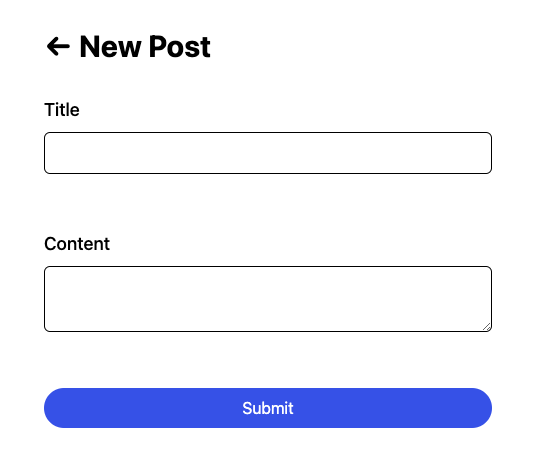

# The FormData API: Craft Better Web Forms Using Web Standards

TODO: Intro

## Example: A Simple Form

[WIP: Express starter example]

Let's start with a simple example. Consider the following demo application where a user can submit a post with a `title` and some `content`:



The initial HTML for this form looks relatively simple:

<details>
	<summary>View Example HTML</summary>

```html
<!DOCTYPE html>
<html lang="en">
  <head>
    <meta charset="UTF-8" />
    <meta name="viewport" content="width=device-width, initial-scale=1.0" />
    <!-- We'll use Tailwind CSS to generate this stylesheet -->
    <link rel="stylesheet" href="/styles.css" />
    <title>Create New Post | Forms Demo</title>
  </head>
  <body>
    <div class="mx-auto flex max-w-lg flex-col gap-8 p-8">
      <a href="/posts">
        <h1 class="text-3xl font-bold">&larr; New Post</h1>
      </a>
      <form action="/posts" method="post" class="flex flex-col gap-2">
        <label htmlFor="title" class="text-lg font-medium">Title</label>
        <input
          type="text"
          id="title"
          name="title"
          class="mb-2 rounded-md border border-black p-2 disabled:bg-slate-200"
          autofocus
        />
        <div class="min-h-[32px] px-4 pb-3 pt-1">
          <!-- If there are errors for the title, render an error list here! -->
        </div>

        <label htmlFor="content" class="text-lg font-medium">Content</label>
        <textarea
          name="content"
          id="content"
          class="mb-2 rounded-md border border-black p-2 disabled:bg-slate-200"
        ></textarea>
        <div class="min-h-[32px] px-4 pb-3 pt-1">
          <!-- If there are errors for the content, render an error list here! -->
        </div>

        <!-- While we're at it, let's also render an error list here in case the form itself has errors -->

        <button
          name="intent"
          value="submit"
          type="submit"
          class="flex items-center justify-center gap-2 rounded-full bg-blue-600 py-2 text-center text-white disabled:bg-blue-400"
        >
          Submit
        </button>
      </label>
    </div>
  </body>
</html>
```

</details>

The `<form>`'s `method` and `action` attributes tell it to make an HTTP `POST` to the `/posts` route whenever the user submits the form.

Of course, that's just HTML. We can try to submit that form however many times we like, but it won't work unless we have a way to handle whatever values we submit. That means we'll still need _a server_ to process these values, validate the submitted data as needed, and save the post data somewhere so we can view them later in another page.

To keep things simple, let's use Node.js and Express to quickly set up a server that listens for our submitted form values.

### Want to follow along?

For the purposes of this demo, I've set up a basic Express server in [`01-express`](./01-express/) containing everything we'll need for this example. Here's a quick overview of what we're using:

- Basic Express + TypeScript app
- EJS for templating
- Tailwind CSS for styling
- SQLite for data storage
- Prisma for type-safe database queries

If you want to follow along, navigate to the [`01-express`](./01-express/) folder and follow the following steps:

1. Install the dependencies of each app:
   ```sh
    npm install
   ```
2. Initialize the database:
   ```sh
    npx prisma db push
   ```
3. Run the app!
   ```sh
    npm run dev
   ```

Let's take a look at the starter code:

<details>
	<summary>src/routes/posts.starter.ts</summary>

```ts
import express from "express";
import { PrismaClient } from "@prisma/client";

import { invariant } from "../utils/misc";

const prisma = new PrismaClient();

const router = express.Router();

router
  .route("/")
  .get(async (req, res) => {
    const posts = await prisma.post.findMany({
      select: {
        title: true,
        tags: true,
        content: true,
      },
    });

    return res.render("posts-list", { posts });
  })
  .post(async (req, res) => {
    const formData = req.body;

    const title = formData.title;
    const content = formData.content;

    invariant(typeof title === "string", "Title must be a string");
    invariant(typeof content === "string", "Content must be a string");

    await prisma.post.create({
      data: { title, content },
    });

    return res.redirect("/posts");
  });

router.route("/new").get((req, res) => {
  res.render("new-post", {
    status: "idle",
    submission: null,
    errors: null,
  });
});

export default router;
```

</details>

Our server listens to three different kinds of HTTP requests:

- `/posts` (`"GET"` method) - Displays a list of posts from the SQlite database
- `/posts/new` (`"GET"` method) - Displays a list of posts from the SQlite database
- `/posts` (`"POST"` method) - Accepts the form submissions and saves the data into the SQLite database

By default, Express doesn't do anything to whatever values we include in our requests, such as our form submission values. Instead, we use middlewares that process these values and pass them along to our route handler functions via `req.body`. Fortunately, Express offers some built-in middlewares we can use, such as the `express.urlencoded()` middleware I've already set up in `src/index.ts`:

```ts
// src/index.ts
app.use(express.urlencoded({ extended: false }));
```

With that set up, we can get the `title` and `content` values from the `req.body` in our `router.post()` handler, and we can now submit the form from the example earlier and whatever `title` and `content` we submit will persist in the database and shown when you navigate back to the `/posts` route.

## Validating Inputs

Right now, we can submit anything through the form we built and it's going to be saved directly to the database. While there's nothing particularly _wrong_ about our simple example, more often than not most real-world requirements will have some kind of constraints on what kind of data can be accepted before saving to the database.

With that in mind, let's add some validation features into our handler! We'll add the following constraints to the `title` and `content` before we save it to our database:

- both `title` and `content` should be strings
- `title` should be required and must be 100 characters or less
- `content` should be required and must be 10000 characters or less

For invalid submissions, we'll need to display the form back along with some error messages that tell the user which parts of the submission were invalid. Since we're using TypeScript to build our example, it's also helpful to define a consistent error structure for the error data we'll be returning in the case of invalid submissions:

```ts
type ActionErrors = {
  formErrors: Array<string>;
  fieldErrors: {
    title: Array<string>;
    content: Array<string>;
  };
};
```

Now we can apply the constraints to the form sumbissions and send a some error data back when a user makes an invalid submission:

<details>
	<summary>src/routes/posts.ts</summary>

```ts
const titleMaxLength = 100;
const contentMaxLength = 10000;

router
  .route("/")
  // ...
  .post(async (req, res) => {
    // get title and content from req.body...

    const errors: ActionErrors = {
      formErrors: [],
      fieldErrors: {
        title: [],
        content: [],
      },
    };

    if (title === "") {
      errors.fieldErrors.title.push("Title is required");
    }
    if (title.length > titleMaxLength) {
      errors.fieldErrors.title.push("Title must be at most 100 characters");
    }

    if (content === "") {
      errors.fieldErrors.content.push("Content is required");
    }
    if (content.length > contentMaxLength) {
      errors.fieldErrors.content.push(
        "Content must be at most 10000 characters"
      );
    }

    const hasErrors =
      errors.formErrors.length ||
      Object.values(errors.fieldErrors).some(
        (fieldErrors) => fieldErrors.length
      );
    if (hasErrors) {
      return res.render("new-post", {
        status: "error",
        submission: null,
        errors,
      });
    }

    // call Prisma to save the post to our DB...
  });
```

</details>

<!-- TODO: Add back snippet for new-post.ejs -->

It would also be helpful to the user if we can show their previous inputs back when we refresh the form after an invalid submission. To do this, we simply need to include a `submission` object to our `res.render()` containing whatever input they've previously submitted:

```diff
// src/routes/posts.ts
if (hasErrors) {
  return res.render("new-post", {
    status: "error",
-    submission: null,
+    submission: { title, content },
    errors,
  });
}
```

```diff
// src/views/new-post.ts
<input
  type="text"
  id="title"
  name="title"
  class="mb-2 rounded-md border border-black p-2 disabled:bg-slate-200"
+  value="<%=submission?.title %>"
  autofocus
/>
```

```diff
// src/views/new-post.ts
<textarea
  name="content"
  id="content"
  class="mb-2 rounded-md border border-black p-2 disabled:bg-slate-200"
-></textarea>
+><%=submission?.content %></textarea>
```

### Simplifying Validation Logic

Looking at our `router.post()` handler, it's clear that we're duplicating a bunch of logic across the different inputs we're checking. Unfortunately, this only gets worse as requirements become stricter and our contraints become more complex.

This is one of the times where it's reasonable to reach for an open-source library to handle these validation steps for us. In our example, let's use [Zod](https://zod.dev/) to simplify our validation logic:

<details>
	<summary>src/routes/posts.ts</summary>

```diff
+import { z } from "zod";

// ...

-type ActionErrors = {
-  formErrors: Array<string>;
-  fieldErrors: {
-    title: Array<string>;
-    content: Array<string>;
-  };
-};

const titleMaxLength = 100;
const contentMaxLength = 10000;

+const PostEditorSchema = z.object({
+  title: z.string().min(1).max(titleMaxLength),
+  content: z.string().min(1).max(contentMaxLength),
+});

router
  .route("/")
  // ...
  .post(async (req, res) => {
    // get title and content from req.body...

-    const errors: ActionErrors = {
-      formErrors: [],
-      fieldErrors: {
-        title: [],
-        content: [],
-      },
-    };
-
-    if (title === "") {
-      errors.fieldErrors.title.push("Title is required");
-    }
-    if (title.length > titleMaxLength) {
-      errors.fieldErrors.title.push("Title must be at most 100 characters");
-    }
-
-    if (content === "") {
-      errors.fieldErrors.content.push("Content is required");
-    }
-    if (content.length > contentMaxLength) {
-      errors.fieldErrors.content.push(
-        "Content must be at most 10000 characters"
-      );
-    }
-
-    const hasErrors =
-      errors.formErrors.length ||
-      Object.values(errors.fieldErrors).some(
-        (fieldErrors) => fieldErrors.length
-      );
+    const result = PostEditorSchema.safeParse({
+      title,
+      content,
+    });
-    if (hasErrors) {
+    if (!result.success) {
      return res.render("new-post", {
        status: "error",
        submission: { title, content },
-        errors,
+        errors: result.error.flatten(),
      });
    }

    // call Prisma to save the post to our DB...
  });
```

</details>

Even with our simple example, that's still a lot of duplicated code we just removed! This will become even more useful once we add a more complex input example later.

### Making the Error Displays Accessible

We can use ARIA attributes to make our error messages more descriptive to users that use accessibility tools such as screen readers:

<details>
	<summary>src/views/new-post.ejs</summary>

```diff
        <input
          type="text"
          id="title"
          name="title"
          value="<%=submission?.title %>"
          class="mb-2 rounded-md border border-black p-2 disabled:bg-slate-200"
          autofocus
+          <%_ if (titleHasErrors) { -%>
+          aria-invalid="true"
+          aria-describedby="errors-title"
+          <%_ } -%>
        />
```

```diff
        <textarea
          name="content"
          id="content"
          class="mb-2 rounded-md border border-black p-2 disabled:bg-slate-200"
+          <%_ if (contentHasErrors) { -%>
+          aria-invalid="true"
+          aria-describedby="errors-content"
+          <%_ } -%>
        >
```

</details>

> [!NOTE]
>
> It's often said that the first rule of ARIA is "don't use ARIA". That is, we should avoid putting unnecessary ARIA attributes to our elements whenever we can adequately describe them using HTML attributes alone. As such, we're wrapping the ARIA attributes inside `if` blocks so that we only apply them whenever the assiciated input is actually invalid.

## Adding a List of Inputs

Suppose there's a new feature we want to add to our posts example. Let's say we want to optionally add a list of `tags` to each post in addition to the `title` and `content` that we already have.

Let's keep using out Zod schema to define our new `tags` list:

```diff
+const tagMaxLength = 25;

const PostEditorSchema = z.object({
  title: z.string().min(1).max(titleMaxLength),
+  tags: z.array(z.string().min(1).max(tagMaxLength)).optional(),
  content: z.string().min(1).max(contentMaxLength),
});
```

Let's also update our EJS template to display our list of inputs. First, let's get the `tags` from the `submission`:

```ejs
<%_ const tagsList = submission?.tags ?? [] -%>
```

Then, add this between the `title` and `content` inputs:

```ejs
<!-- We'll handle accessibility for the tag input list later! -->
<label for="tags" class="text-lg font-medium">Tags</label>
<ul id="tags" class="flex flex-col gap-2">
  <%_tagsList.map((tag, idx) => { %>
  <li class="flex items-center gap-2">
    <input
      type="text"
      name="tags[<%=idx %>]"
      id="tags[<%=idx %>]"
      value="<%=tag %>"
      class="text-xs rounded-md border border-black p-2 disabled:bg-slate-200"
    />
    <button type="submit" name="intent" value="list-remove/<%=idx %>">
      ❌
    </button>
  </li>
  <%_ })%>
</ul>
<%_if (tagsList.length < 5) { %>
<button
  type="submit"
  name="intent"
  value="list-insert"
  class="self-start rounded-full bg-blue-600 px-4 py-2 text-xs text-center text-white disabled:bg-blue-400"
>
  + Add Tag
</button>
<%_ } %>
<div class="min-h-[32px] px-4 pb-3 pt-1">
  <% if(fieldErrors?.tags) { %>
    <%- include("partials/error-list", { errors: fieldErrors.tags, id: "errors-tags" }) %>
  <% } %>
</div>
```

### Using Submission Intents

With the addition of the `tags` input list, our `router.post()` handler will get a bit more complicated. In addition to handling our usual form submissions, we'll also want to handle two more cases where the user adds or removes an item from the `tags` list.

This is where submission intents could be useful. In a nutshell, we can attach a particular `name` and `value` to our submit buttons:

```html
<button
  type="submit"
  name="intent"
  value="list-insert"
  class="self-start rounded-full bg-blue-600 px-4 py-2 text-xs text-center text-white disabled:bg-blue-400"
>
  + Add Tag
</button>
```

```html
<button type="submit" name="intent" value="list-remove/<%=idx %>">❌</button>
```

By adding a `name` and a `value` to our submit buttons, we can add an additional field in our form data to represent our submission intent. This is how we can determine whether the user wants to add/remove an item to the `tags` list or submit the entire form.

There's a subtle bug you might experience after adding the `tags` input list this way. If you press `Enter` on a text input, you may notice that it adds or removes an item to the `tags` list instead. This is because pressing `Enter` on a text input the form will trigger a submission using the first (or topmost) submit button inside it. This also uses the `name` and `value` associated with that button, which in our case is one of the list add/remove buttons.

To fix this, we simply need to add a hidden submit button at the very top of our form:

```html
<button name="intent" value="submit" type="submit" class="hidden"></button>
```

Now, let's actually handle the different submission intents in our `router.post()` handler:

<details>
	<summary>src/routes/posts.ts</summary>

```diff
router
  .route("/")
  // ...
  .post(async (req, res) => {
    const formData = req.body;

    const title = formData.title;
    const content = formData.content;
+    const intent = formData.intent;

    invariant(typeof title === "string", "Title must be a string");
    invariant(typeof content === "string", "Content must be a string");
+    invariant(typeof intent === "string", "Intent must be a string");

+    let tags: string[] = [];
+    for (let [key, value] of Object.entries(formData)) {
+      if (key.startsWith("tags[") && key.endsWith("]")) {
+        //? Get the index number, e.g. tags[1] -> 1
+        const index = +key.slice(5, -1);
+        // You can also typecheck this with the `invariant()` utility:
+        tags[index] = value as string;
+      }
+    }
+
+    if (intent === "list-insert") {
+      tags.push("");
+      return res.render("new-post", {
+        status: "idle",
+        submission: { title, tags, content },
+        errors: null,
+      });
+    }
+
+    if (intent.startsWith("list-remove")) {
+      const idx = +intent.split("/")[1];
+      tags.splice(idx, 1);
+      return res.render("new-post", {
+        status: "idle",
+        submission: { title, tags, content },
+        errors: null,
+      });
+    }

    const result = PostEditorSchema.safeParse({
      title,
+      tags,
      content,
    });
    if (!result.success) {
      return res.render("new-post", {
        status: "error",
-        submission: { title, content },
+        submission: { title, tags, content },
        errors: result.error.flatten(),
      });
    }

    await prisma.post.create({
=      data: { title, content },
+      data: {
+        title: result.data.title,
+        //? Can't store arrays in SQLite, so just turn em into a comma-separated string
+        tags: result.data.tags?.join(","),
+        content: result.data.content,
+      },
    });

    return res.redirect("/posts");
  })
```

</details>

You may have noticed that getting the `tags` array from the form submission data is a bit more complicated. This is because the real `FormData` API has a rather peculiar way of representing an array of inputs. It works similar to URL search params (hence you might see `x-www-form-urlencoded` as the default `content-type` when you check our `POST` requests in the Network tab), where you can assign multiple values into a single field name:

```html
<form>
  <input type="text" name="tags" value="tag-1" />
  <input type="text" name="tags" value="tag-2" />
  <input type="text" name="tags" value="tag-3" />
</form>
```

Which in turn will get represented as:

```js
const formData = new FormData(form);
formData.getAll("tags"); // ["tag-1", "tag-2", "tag-3"]
```

That works fine for a simple list of inputs, but consider another example where there's multiple inputs associated with each list item:

```html
<form>
  <input type="text" name="todo" value="Buy milk" />
  <input type="checkbox" name="completed" checked />
  <input type="text" name="todo" value="Buy eggs" />
  <input type="checkbox" name="completed" />
  <input type="text" name="todo" value="Wash dishes" />
  <input type="checkbox" name="completed" checked />
</form>
```

```js
const formData = new FormData(form);
formData.getAll("todo"); // ["Buy milk", "Buy eggs", "Wash dishes"]
formData.getAll("completed"); // ["on", "on"]
```

And here's where we see some problems with the basic approach. Some values in the `FormData` API, such as checkboxes, have visible values if they're filled in, but get skipped altogether if they're not filled in. This means we can't simply rely on the order of values to see chich of the nested fields have values or not. We'll have to do some extra work to provide more specific names for these nested fields so that we can track them more accurately:

```html
<form>
  <input type="text" name="todo[0].content" value="Buy milk" />
  <input type="checkbox" name="todo[0].complete" checked />
  <input type="text" name="todo[1].content" value="Buy eggs" />
  <input type="checkbox" name="todo[1].complete" />
  <input type="text" name="todo[2].content" value="Wash dishes" />
  <input type="checkbox" name="todo[2].complete" checked />
</form>
```

```js
const formData = new FormData(form);
formData.get("todo[0].content"); // "Buy milk"
formData.get("todo[0].complete"); // "on"
formData.get("todo[1].content"); // "Buy eggs"
formData.get("todo[1].complete"); // null
formData.get("todo[2].content"); // "Wash dishes"
formData.get("todo[2].complete"); // "on"
```

With the form data represented this way, we can use some custom JS to parse it into a more readable structure:

```js
{
  todos: [
    { content: "Buy milk", complete: true },
    { content: "Buy eggs", complete: false },
    { content: "Wash dishes", complete: true },
  ],
};
```

This approach is what we're using to represent our `tags` list. We simply iterate over the form entries to see `tags[number]` fields, then manually push each value into our own array.

```ts
let tags: string[] = [];
for (let [key, value] of Object.entries(formData)) {
  if (key.startsWith("tags[") && key.endsWith("]")) {
    //? Get the index number, e.g. tags[1] -> 1
    const index = +key.slice(5, -1);
    // You can also typecheck this with the `invariant()` utility:
    tags[index] = value as string;
  }
}
```

> [!IMPORTANT]
>
> Technically, Express already provides its own utilities so we don't have to iterate over all form entries like this. If you set `express.urlencoded({ extended: true })` in `src/index.ts`, the middleware will automatically transform the request body so that we can directly get an array in `formData.tags`. However, since it's a feature that's specific to Express (and other similar frameworks), I'm keeping the solution as it is to make it closer to how the real `FormData` API is used in the later examples.

## A New Standard: Web Fetch API

TODO: Hono example

## What about ReactJS?

TODO: MERN v1 example

### Improve Data Fetching with React Router 6.4

TODO: MERN v2 example

## Full Stack Progressive Enhancement

TODO: Remix v1 example

### [TODO: sub-section name for Conform JS]

TODO: Remix v2 + MERN v3 example

OPTIONAL: Demo note editor with image upload example from EpicWeb
